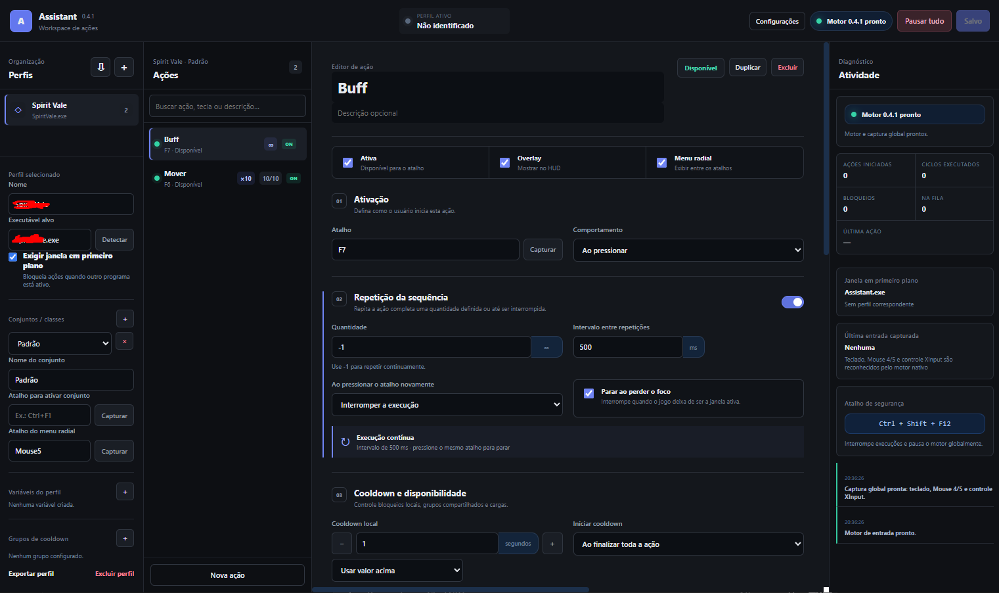

<p align="center">
  
</p>

<h1 align="center">KeyFlow Assistant</h1>

<p align="center">
  Gerenciador de ações manuais para Windows com perfis por aplicativo, sequências de teclado e mouse, repetição controlada, cooldowns e HUD transparente.
</p>

<p align="center">
  
  
  
  
  
</p>

<p align="center">
  <a href="https://github.com/loganout/KeyFlow-Assistant/releases/latest"><strong>Baixar a versão mais recente</strong></a>
  ·
  <a href="https://github.com/loganout/KeyFlow-Assistant/issues">Relatar um problema</a>
</p>

<br>

<p align="center">
  
</p>

<p align="center">
  <sub>Interface principal do KeyFlow Assistant.</sub>
</p>

---

## Sobre o KeyFlow Assistant

O **KeyFlow Assistant** permite transformar um acionamento manual em uma sequência organizada de entradas de teclado e mouse. As ações podem ser separadas por perfil, conjunto e aplicativo-alvo, facilitando a manutenção de configurações diferentes para jogos, programas e rotinas de acessibilidade.

O aplicativo foi desenvolvido com foco em:

- configuração visual, sem edição manual de arquivos;
- execução previsível e fácil de interromper;
- HUD discreto e reposicionável;
- armazenamento local das configurações;
- reutilização dos mesmos atalhos em aplicativos diferentes;
- proteção contra entradas presas e execuções fora de contexto.

> [!IMPORTANT]
> O KeyFlow Assistant não lê memória, pixels, vida, inventário, inimigos ou qualquer estado interno do aplicativo-alvo. Ele não injeta código em outros processos e não procura contornar mecanismos de proteção. Todas as ações são configuradas e iniciadas pelo usuário.

## Sumário

- [Principais recursos](#principais-recursos)
- [Requisitos](#requisitos)
- [Download e instalação](#download-e-instalação)
- [Primeiros passos](#primeiros-passos)
- [Repetição da sequência](#repetição-da-sequência)
- [Cooldowns, grupos e cargas](#cooldowns-grupos-e-cargas)
- [Overlay e menu radial](#overlay-e-menu-radial)
- [Dados, backup e privacidade](#dados-backup-e-privacidade)
- [Solução de problemas](#solução-de-problemas)
- [Limites operacionais](#limites-operacionais)
- [Uso responsável](#uso-responsável)
- [Relatar problemas](#relatar-problemas)
- [Distribuição e direitos autorais](#distribuição-e-direitos-autorais)

## Principais recursos

### Perfis e conjuntos

- Perfis associados ao executável de cada jogo ou programa.
- Detecção do aplicativo em primeiro plano.
- Uso do mesmo atalho em perfis diferentes.
- Conjuntos independentes dentro de um perfil.
- Organização por classes, personagens, builds ou contextos de trabalho.
- Atalhos próprios para alternar conjuntos sem abrir a janela principal.

### Acionamentos

O KeyFlow Assistant reconhece:

- teclado e combinações com modificadores;
- Mouse 4 e Mouse 5;
- roda do mouse para cima e para baixo;
- controles compatíveis com XInput, em caráter experimental;
- botões A, B, X, Y, LB, RB, LT, RT, direcional, Start, Back, L3 e R3.

Modos disponíveis:

| Modo | Comportamento |
|---|---|
| Ao pressionar | Executa quando o botão é pressionado. |
| Ao soltar | Executa quando o botão é liberado. |
| Duplo toque | Exige dois acionamentos dentro do intervalo configurado. |
| Pressionamento longo | Executa após manter o botão pressionado pelo tempo definido. |
| Enquanto segura | Repete somente enquanto o botão físico permanecer pressionado. |

### Editor de ações

Cada ação pode combinar etapas de:

- pressionar uma tecla;
- aguardar um intervalo;
- clicar ou segurar botões do mouse;
- usar Mouse 4 ou Mouse 5;
- rolar a roda do mouse;
- executar outra ação como subação reutilizável;
- reproduzir um aviso sonoro.

O editor também oferece:

- captura visual de teclas e botões;
- reordenação e duplicação de etapas;
- gravador de sequência finita;
- variáveis de tecla e tempo por perfil;
- estimativa da duração de cada ciclo;
- diagnóstico de entradas, bloqueios e execuções.

### Repetição controlada

- Quantidade configurável entre `1` e `9.999` ciclos.
- Valor `-1` para repetição contínua.
- Intervalo configurável entre os ciclos.
- Interrupção ao pressionar novamente o mesmo atalho.
- Botão **Parar execução** na interface.
- Parada automática opcional ao perder o foco do aplicativo-alvo.
- Progresso exibido no editor e no overlay.

### Cooldowns, grupos e cargas

- Cooldown individual por ação.
- Início do cooldown ao começar ou ao finalizar a execução completa.
- Grupos de cooldown compartilhado.
- Até dez cargas por ação.
- Recarga individual de cada carga.
- Reset e reinício manual do contador.
- Valores fixos ou vinculados a variáveis do perfil.

### Overlay transparente

- HUD sempre acima do aplicativo-alvo.
- Fundo da janela transparente.
- Modos **Minimalista**, **Micro HUD** e **Barra horizontal**.
- Exibição de tecla, nome, estado, repetição, cargas e cooldown.
- Opacidade e escala configuráveis.
- Opção para mostrar somente ações em atividade.
- Ocultação automática fora do perfil associado.
- Passagem de cliques para não interferir no aplicativo.
- Reposicionamento livre, com posição salva automaticamente.

### Menu radial

- Até oito ações por conjunto.
- Acionamento por teclado ou mouse.
- Seleção pela direção do cursor.
- Zona central para cancelar.
- Janela transparente, sem captura permanente do foco.

### Organização e operação

- Busca por nome, descrição ou tecla.
- Fila opcional quando outra ação já está em execução.
- Minimização para a bandeja do Windows.
- Inicialização automática opcional.
- Pausa global do motor.
- Parada de emergência em `Ctrl + Shift + F12`.
- Importação e exportação de perfis.
- Backup completo das configurações.
- Migração automática de versões anteriores.

## Requisitos

| Requisito | Observação |
|---|---|
| Sistema operacional | Windows 10 ou Windows 11, 64 bits. |
| PowerShell | Normalmente já incluído no Windows. |
| Permissões | O Assistant e o aplicativo-alvo devem usar o mesmo nível de permissão. |
| Modo de exibição | Para o overlay, prefira modo janela ou janela sem bordas. |
| Controle | Opcional; deve ser compatível com XInput. |

A versão instalada **não exige** VS Code, Node.js, npm ou ferramentas de desenvolvimento.

## Download e instalação

1. Abra a página de [Releases](https://github.com/loganout/KeyFlow-Assistant/releases).
2. Entre na versão mais recente.
3. Em **Assets**, baixe o instalador para Windows, com nome semelhante a:

```text
Assistant-0.4.1-x64.exe
```

4. Execute o instalador.
5. Escolha a pasta de instalação.
6. Abra o **KeyFlow Assistant** pelo menu Iniciar ou pelo atalho da área de trabalho.

> [!NOTE]
> O GitHub adiciona automaticamente arquivos chamados **Source code (zip)** e **Source code (tar.gz)** em todas as Releases. Esses arquivos correspondem apenas ao conteúdo público deste repositório e **não contêm o código-fonte do aplicativo**. Para instalar o programa, baixe o arquivo `.exe` anexado em **Assets**.

> [!WARNING]
> O aplicativo pode ser distribuído sem assinatura digital. Nesse caso, o Windows SmartScreen ou algum antivírus pode solicitar confirmação. Baixe o instalador somente das Releases oficiais deste repositório.

> [!TIP]
> Caso o jogo ou programa-alvo seja executado como administrador, abra o KeyFlow Assistant como administrador também. Um processo sem elevação normalmente não consegue enviar entradas para outro processo elevado.

## Primeiros passos

### 1. Configure um perfil

1. Selecione ou crie um perfil.
2. Abra o jogo ou programa desejado.
3. Clique em **Detectar**.
4. Mude para a janela-alvo e aguarde a detecção.
5. Confirme o nome do executável.

### 2. Crie uma ação

1. Clique em **Nova ação**.
2. Escolha o conjunto ao qual ela pertence.
3. Defina o acionamento, como `F7`, `Ctrl + Q` ou `Mouse 4`.
4. Escolha o modo de acionamento.
5. Adicione uma ou mais etapas.
6. Ative a ação e salve.

Exemplo:

```text
Acionamento: F7

1. Pressionar tecla 1 por 40 ms
2. Aguardar 150 ms
3. Pressionar tecla 2 por 40 ms
4. Aguardar 180 ms
5. Pressionar tecla 3 por 40 ms
```

### 3. Faça um teste inicial

Antes de usar em um jogo:

1. abra o Bloco de Notas;
2. desative temporariamente a exigência de primeiro plano ou associe um perfil ao Bloco de Notas;
3. configure uma ação que envie uma tecla simples;
4. confirme se a quantidade, os intervalos e a interrupção funcionam como esperado.

## Repetição da sequência

A repetição envolve a sequência completa da ação.

### Quantidade definida

```text
Quantidade: 10
Intervalo: 500 ms
```

A sequência será executada dez vezes. O intervalo é aplicado entre os ciclos, sem espera adicional após o último.

### Repetição contínua

```text
Quantidade: -1
Intervalo: 500 ms
```

A execução continua até uma destas condições:

- o mesmo atalho ser pressionado novamente;
- o botão **Parar execução** ser acionado;
- a parada de emergência ser utilizada;
- o motor ser pausado;
- o aplicativo-alvo perder o foco, quando essa proteção estiver ativada;
- o KeyFlow Assistant ser encerrado.

> [!WARNING]
> Use intervalos adequados. No modo contínuo, o intervalo mínimo efetivo é de 50 ms. O modo **Enquanto segura** possui repetição própria e não pode ser combinado com a repetição da sequência.

## Cooldowns, grupos e cargas

O cooldown do KeyFlow Assistant é um contador local. Ele não lê o cooldown real do jogo ou programa.

É possível escolher quando o contador começa:

- **Ao iniciar:** começa no primeiro ciclo.
- **Ao finalizar:** começa após a última repetição ou após uma interrupção já iniciada.

As cargas e os cooldowns são consumidos uma vez por acionamento da ação, não uma vez por ciclo.

Os grupos compartilhados permitem que várias ações utilizem o mesmo bloqueio. Um exemplo comum é um grupo de poções, no qual o uso de uma ação bloqueia temporariamente as demais.

## Overlay e menu radial

### Reposicionar o overlay

1. Abra **Preferências**.
2. Clique em **Reposicionar overlay**.
3. Arraste pela alça exibida no HUD.
4. Clique em **Concluir**.

A posição é salva automaticamente. O mesmo comando também está disponível no menu da bandeja.

### Configuração recomendada para jogos

```text
Ocultar fora do perfil: ativado
Mostrar somente ativos: ativado
Ignorar cliques: ativado
Opacidade: 0,80 a 0,90
Escala: 0,85 a 1,00
```

Caso o overlay não apareça sobre um jogo em tela cheia, use **janela sem bordas** ou **modo janela**.

## Dados, backup e privacidade

Na versão atual:

- as configurações permanecem no computador do usuário;
- não é necessário criar conta;
- não há telemetria;
- não há sincronização online;
- o funcionamento normal não depende de internet após a instalação.

A pasta de dados pode ser aberta por:

```text
Preferências → Abrir pasta de dados
```

No Windows, ela normalmente corresponde a:

```text
%APPDATA%\Assistant\
```

O arquivo principal de configuração é:

```text
assistant-config.json
```

Antes de atualizar, formatar o computador ou alterar configurações importantes, utilize **Exportar backup** ou **Exportar perfil**.

## Solução de problemas

### A entrada é capturada, mas a ação não executa

Verifique:

- se **Ação ativa** está habilitada;
- se o executável do perfil está configurado corretamente;
- se o conjunto correto está ativo;
- se a janela-alvo está em primeiro plano;
- se a ação está em cooldown ou sem cargas;
- se o motor está pausado;
- se outra ação está em execução;
- se o KeyFlow Assistant e o aplicativo-alvo usam o mesmo nível de permissão.

### O overlay não aparece

- Ative o overlay em **Preferências**.
- Confirme se a ação está marcada para aparecer no overlay.
- Desative temporariamente **Mostrar somente ativos**.
- Confirme se o perfil foi identificado.
- Teste com **Ocultar fora do perfil** desativado.
- Use modo janela ou janela sem bordas.

### O overlay não pode ser arrastado

- Use **Preferências → Reposicionar overlay**.
- Arraste pela alça exibida durante o modo de posicionamento.
- Clique em **Concluir** para restaurar a passagem de cliques.

### O aplicativo-alvo está sendo executado como administrador

Feche o KeyFlow Assistant e abra-o usando **Executar como administrador**. O nível de permissão precisa ser igual ao do aplicativo-alvo.

### O antivírus sinalizou o componente de entrada

Ferramentas que capturam atalhos globais e enviam entradas podem receber análise adicional de antivírus. Confirme que o instalador foi obtido das Releases oficiais.

### O CMD fica aberto

Isso ocorre apenas nas versões usadas durante desenvolvimento ou testes internos. A versão instalada pela Release deve funcionar sem terminal aberto.

### Mouse ou controle não foi reconhecido

- Abra o diagnóstico e confirme se o motor está pronto.
- Utilize a opção de reparar ou recompilar o componente de entrada, quando disponível.
- Para controles, confirme que o dispositivo é reconhecido como XInput pelo Windows.
- O suporte a controles ainda é experimental.

## Limites operacionais

| Item | Limite atual |
|---|---:|
| Etapas configuradas por ação | 30 |
| Etapas após expansão de subações | 60 |
| Duração máxima de cada ciclo | 20 segundos |
| Repetições finitas | 1 a 9.999 |
| Intervalo mínimo no modo contínuo | 50 ms |
| Cargas por ação | 1 a 10 |
| Itens no menu radial | Até 8 |
| Variáveis por perfil | Até 40 |
| Tamanho máximo da fila | Até 10 ações |

A parada de emergência padrão é:

```text
Ctrl + Shift + F12
```

Ela interrompe execuções, repetições, fila e temporizadores, além de liberar entradas mantidas pelo KeyFlow Assistant.

## Uso responsável

O KeyFlow Assistant foi projetado como uma ferramenta local de atalhos, acessibilidade e qualidade de vida.

O aplicativo não oferece:

- leitura de memória de outros processos;
- reconhecimento de tela ou análise de pixels;
- seleção automática de alvos;
- movimentação autônoma;
- coleta automática;
- injeção de código;
- ocultação do processo;
- evasão de sistemas de proteção ou anti-cheat.

Cada jogo, programa ou serviço possui regras próprias. Verifique os termos de uso do aplicativo-alvo antes de utilizar sequências de entrada, especialmente repetições contínuas.

O usuário é responsável pelas ações configuradas e pelo uso do aplicativo em conformidade com as regras do software-alvo.

## Relatar problemas

Para relatar uma falha ou sugerir uma melhoria, abra uma [Issue](https://github.com/loganout/KeyFlow-Assistant/issues).

Ao relatar um problema, inclua, quando possível:

- versão do KeyFlow Assistant;
- versão do Windows;
- nome do aplicativo-alvo;
- modo de acionamento utilizado;
- passos para reproduzir;
- captura de tela sem informações pessoais;
- mensagem apresentada no diagnóstico.

Não publique arquivos de configuração que contenham informações pessoais ou caminhos privados sem revisá-los antes.

## Distribuição e direitos autorais

O KeyFlow Assistant é distribuído em formato compilado para usuários finais.

O código-fonte do aplicativo não é distribuído por este repositório. O acesso ao instalador não concede autorização para copiar, modificar, redistribuir, revender ou criar versões derivadas do aplicativo.

Copyright © 2026 Daniel. Todos os direitos reservados.

Para solicitações relacionadas a distribuição, parceria ou autorização de uso, utilize a área de Issues do repositório.
